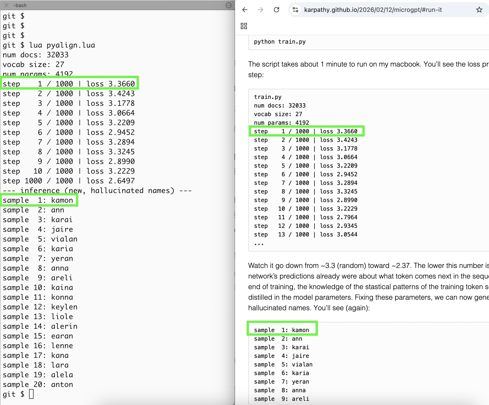

# microgpt.lua

microgpt.lua (300 lines) — a Lua port of Andrej Karpathy's [microgpt]. Runs standalone, or with alignment scripts to verify exact numerical match: same loss, same samples. Lua interpreter + microgpt.lua + alignment scripts + training data — everything needed, combined under 0.5MB.




## Quick Start
```bash
lua microgpt.lua
```

Trains for 1,000 steps on `input.txt` (a names dataset, included), then samples 20 generated names.
Takes a few minutes on a modern laptop.

**Requirements:** Lua 5.1+, no external dependencies.

## Files

| File | Description |
|------|-------------|
| `microgpt.lua` | **300 lines**, self-contained. Autograd, model, training, inference |
| `pyalign.lua`  | Alignment test against the Python reference |
| `pyrand.lua`   | Python-compatible RNG used by `pyalign.lua` |
| `input.txt` | Training data: 32K common names (via [microgpt]) |

## Why Lua

- **Small:** Lua binary (~184K) + script (~10K) + training data (~223K) = ~417KB total
- **Simple:** Lua has only one composite data structure — the table — which serves as array, map, and object
- **Sufficient:** tables are enough to implement autograd — both forward and backward passes for microgpt (see [Autograd] in the [microgpt blog])

## Correctness & Alignment

`pyalign.lua` verifies that outputs match the Python reference implementation:
```bash
lua pyalign.lua
```

Loss values and sampled names align with the [microgpt blog][Run it].

## License

MIT

[microgpt]: https://gist.github.com/karpathy/8627fe009c40f57531cb18360106ce95
[microgpt blog]: https://karpathy.github.io/2026/02/12/microgpt/
[Autograd]: https://karpathy.github.io/2026/02/12/microgpt/#autograd
[Run it]: https://karpathy.github.io/2026/02/12/microgpt/#run-it
